<!-- README.md is generated from README.Rmd. Please edit that file -->
<!-- The code in README.Rmd is borrowed from vignettes/CodaBonito.Rmd from the 
setup chunk onwards-->
This document offers a brief introduction to the functions in this
library. Some function might be fairly straightforward to create but
some functions may need you to look up the help entry before trying it
out.

Disclaimer / Call for Inputs
----------------------------

This library is very much in development. It is a compilation of code
I’ve written across different project which is why there may be
syntactical inconsistencies, such as some functions using player names
and some others using player IDs as a reference for players. Some of
this is also code that I have never published the output of so it may
need additional arguments. I have, however, tried to give enough
documentation for each function so anyone trying to use the library
should be well equipped with instructions and a basic understanding of
how the functions work.

Any inputs and feedback is welcome. If you’re on github, then head to
github.com/thecomeonman/CodaBonit, or else get in touch <a href = 
"twitter.com/thecomeonman">on Twitter</a>

How to get started
------------------

Install R from
<a href="https://cran.r-project.org" class="uri">https://cran.r-project.org</a>

Open R and run this command in the console -
`install.packages("devtools");` `library(devtools);`
`install_github("thecomeonman/CodaBonito");`

If you’re interested in running the animated Voronoi, you will also need
to install ImageMagick from
<a href="https://imagemagick.org/script/download.php" class="uri">https://imagemagick.org/script/download.php</a>.
This is a widely used image manipulation library.

And you’re ready to run the examples below!

Data
----

I have added some fake data along with the package to be able to better
explain the usage of these functions.

`dtPlayerMetrics` - aggregated data for players is typically in a format
similar to this, with some extra details about the team they play for,
their age, etc.

<table>
<thead>
<tr class="header">
<th style="text-align: left;">PlayerName</th>
<th style="text-align: left;">TeamName</th>
<th style="text-align: right;">playerId</th>
<th style="text-align: right;">Metric1</th>
<th style="text-align: right;">Metric2</th>
<th style="text-align: right;">Metric3</th>
<th style="text-align: right;">Metric4</th>
<th style="text-align: right;">Metric5</th>
<th style="text-align: right;">Metric6</th>
<th style="text-align: right;">Metric7</th>
</tr>
</thead>
<tbody>
<tr class="odd">
<td style="text-align: left;">gjn xfv</td>
<td style="text-align: left;">jsw</td>
<td style="text-align: right;">1</td>
<td style="text-align: right;">2.229299</td>
<td style="text-align: right;">0.5955696</td>
<td style="text-align: right;">1.0000000</td>
<td style="text-align: right;">0.8763470</td>
<td style="text-align: right;">0.7329688</td>
<td style="text-align: right;">3.158645</td>
<td style="text-align: right;">0.0000013</td>
</tr>
<tr class="even">
<td style="text-align: left;">yqp bfe</td>
<td style="text-align: left;">rzu</td>
<td style="text-align: right;">2</td>
<td style="text-align: right;">3.097161</td>
<td style="text-align: right;">0.9443782</td>
<td style="text-align: right;">0.0029271</td>
<td style="text-align: right;">0.8706489</td>
<td style="text-align: right;">0.8115634</td>
<td style="text-align: right;">2.880184</td>
<td style="text-align: right;">0.0805346</td>
</tr>
<tr class="odd">
<td style="text-align: left;">rjs mrx</td>
<td style="text-align: left;">svk</td>
<td style="text-align: right;">3</td>
<td style="text-align: right;">3.132211</td>
<td style="text-align: right;">0.1286577</td>
<td style="text-align: right;">0.0021049</td>
<td style="text-align: right;">0.9959918</td>
<td style="text-align: right;">1.0587961</td>
<td style="text-align: right;">6.371049</td>
<td style="text-align: right;">0.2331633</td>
</tr>
<tr class="even">
<td style="text-align: left;">jtw fqd</td>
<td style="text-align: left;">rdz</td>
<td style="text-align: right;">4</td>
<td style="text-align: right;">2.440632</td>
<td style="text-align: right;">0.5247019</td>
<td style="text-align: right;">0.9977317</td>
<td style="text-align: right;">0.4593465</td>
<td style="text-align: right;">1.4070274</td>
<td style="text-align: right;">4.061111</td>
<td style="text-align: right;">0.0000364</td>
</tr>
<tr class="odd">
<td style="text-align: left;">gja jvi</td>
<td style="text-align: left;">bhj</td>
<td style="text-align: right;">5</td>
<td style="text-align: right;">3.325477</td>
<td style="text-align: right;">0.9318757</td>
<td style="text-align: right;">0.0000363</td>
<td style="text-align: right;">0.9999948</td>
<td style="text-align: right;">2.2463044</td>
<td style="text-align: right;">7.112237</td>
<td style="text-align: right;">0.0271460</td>
</tr>
<tr class="even">
<td style="text-align: left;">mol euq</td>
<td style="text-align: left;">yza</td>
<td style="text-align: right;">6</td>
<td style="text-align: right;">2.483550</td>
<td style="text-align: right;">0.4419821</td>
<td style="text-align: right;">1.0000000</td>
<td style="text-align: right;">0.9936560</td>
<td style="text-align: right;">1.3460208</td>
<td style="text-align: right;">2.276407</td>
<td style="text-align: right;">0.0845131</td>
</tr>
</tbody>
</table>

`dtMetricCategorisation` - some metadata about the metrics. -
variableLabel is the name that will be displayed in charts for that
metric, - variableCategory is the grouping of variables used in some
visualisations, like `fStripChart` - HighValueIsBad is marked true for
variables where a high value is bad. Variables such as fouls and goals
conceded would be true.

<table>
<thead>
<tr class="header">
<th style="text-align: left;">variable</th>
<th style="text-align: left;">variableLabel</th>
<th style="text-align: left;">variableCategory</th>
<th style="text-align: left;">HighValueIsBad</th>
</tr>
</thead>
<tbody>
<tr class="odd">
<td style="text-align: left;">Metric1</td>
<td style="text-align: left;">Metric 1</td>
<td style="text-align: left;">Offense</td>
<td style="text-align: left;">FALSE</td>
</tr>
<tr class="even">
<td style="text-align: left;">Metric2</td>
<td style="text-align: left;">Metric 2</td>
<td style="text-align: left;">Offense</td>
<td style="text-align: left;">FALSE</td>
</tr>
<tr class="odd">
<td style="text-align: left;">Metric3</td>
<td style="text-align: left;">Metric 3</td>
<td style="text-align: left;">Defense</td>
<td style="text-align: left;">FALSE</td>
</tr>
<tr class="even">
<td style="text-align: left;">Metric4</td>
<td style="text-align: left;">Metric 4</td>
<td style="text-align: left;">Offense</td>
<td style="text-align: left;">TRUE</td>
</tr>
<tr class="odd">
<td style="text-align: left;">Metric5</td>
<td style="text-align: left;">Metric 5</td>
<td style="text-align: left;">Defense</td>
<td style="text-align: left;">FALSE</td>
</tr>
<tr class="even">
<td style="text-align: left;">Metric7</td>
<td style="text-align: left;">Metric 7</td>
<td style="text-align: left;">Defense</td>
<td style="text-align: left;">FALSE</td>
</tr>
</tbody>
</table>

`dtPasses` - passing data. - x,y denote the start coordinates of the
pass - endX, endY denote the end coordinates of the pass - passLength is
the length of the pass - passAngle is the angle of the pass in radians (
180 degress = pi radians ) where 0 is along the pitch from defense to
offense. - Success 1 for successful pass, 0 for failed pass

<table>
<thead>
<tr class="header">
<th style="text-align: right;">playerId</th>
<th style="text-align: right;">x</th>
<th style="text-align: right;">y</th>
<th style="text-align: right;">endX</th>
<th style="text-align: right;">endY</th>
<th style="text-align: right;">passLength</th>
<th style="text-align: right;">passAngle</th>
<th style="text-align: right;">Success</th>
<th style="text-align: right;">recipientPlayerId</th>
</tr>
</thead>
<tbody>
<tr class="odd">
<td style="text-align: right;">1</td>
<td style="text-align: right;">8.187907</td>
<td style="text-align: right;">56.49550</td>
<td style="text-align: right;">10.14677</td>
<td style="text-align: right;">65.23493</td>
<td style="text-align: right;">8.956269</td>
<td style="text-align: right;">2.9552227</td>
<td style="text-align: right;">1</td>
<td style="text-align: right;">3</td>
</tr>
<tr class="even">
<td style="text-align: right;">1</td>
<td style="text-align: right;">4.806998</td>
<td style="text-align: right;">23.82662</td>
<td style="text-align: right;">32.60867</td>
<td style="text-align: right;">74.70806</td>
<td style="text-align: right;">57.981493</td>
<td style="text-align: right;">1.3998821</td>
<td style="text-align: right;">1</td>
<td style="text-align: right;">3</td>
</tr>
<tr class="odd">
<td style="text-align: right;">1</td>
<td style="text-align: right;">6.449829</td>
<td style="text-align: right;">28.04108</td>
<td style="text-align: right;">47.98204</td>
<td style="text-align: right;">41.56566</td>
<td style="text-align: right;">43.678820</td>
<td style="text-align: right;">0.5959662</td>
<td style="text-align: right;">1</td>
<td style="text-align: right;">8</td>
</tr>
<tr class="even">
<td style="text-align: right;">1</td>
<td style="text-align: right;">8.502368</td>
<td style="text-align: right;">25.26964</td>
<td style="text-align: right;">39.34758</td>
<td style="text-align: right;">50.24656</td>
<td style="text-align: right;">39.689717</td>
<td style="text-align: right;">1.0575427</td>
<td style="text-align: right;">1</td>
<td style="text-align: right;">8</td>
</tr>
<tr class="odd">
<td style="text-align: right;">1</td>
<td style="text-align: right;">14.719737</td>
<td style="text-align: right;">53.69758</td>
<td style="text-align: right;">64.79699</td>
<td style="text-align: right;">11.99930</td>
<td style="text-align: right;">65.165003</td>
<td style="text-align: right;">-1.3106447</td>
<td style="text-align: right;">1</td>
<td style="text-align: right;">2</td>
</tr>
<tr class="even">
<td style="text-align: right;">1</td>
<td style="text-align: right;">11.117120</td>
<td style="text-align: right;">49.90731</td>
<td style="text-align: right;">25.42474</td>
<td style="text-align: right;">8.75858</td>
<td style="text-align: right;">43.565195</td>
<td style="text-align: right;">-2.1075148</td>
<td style="text-align: right;">1</td>
<td style="text-align: right;">8</td>
</tr>
</tbody>
</table>

`dtFormation` - Coordinates as per the formation

<table>
<thead>
<tr class="header">
<th style="text-align: right;">playerId</th>
<th style="text-align: right;">x</th>
<th style="text-align: right;">y</th>
</tr>
</thead>
<tbody>
<tr class="odd">
<td style="text-align: right;">1</td>
<td style="text-align: right;">15</td>
<td style="text-align: right;">40</td>
</tr>
<tr class="even">
<td style="text-align: right;">2</td>
<td style="text-align: right;">35</td>
<td style="text-align: right;">20</td>
</tr>
<tr class="odd">
<td style="text-align: right;">3</td>
<td style="text-align: right;">35</td>
<td style="text-align: right;">60</td>
</tr>
<tr class="even">
<td style="text-align: right;">8</td>
<td style="text-align: right;">60</td>
<td style="text-align: right;">40</td>
</tr>
<tr class="odd">
<td style="text-align: right;">9</td>
<td style="text-align: right;">90</td>
<td style="text-align: right;">40</td>
</tr>
</tbody>
</table>

`dtPlayerLabels` - Player labels

<table>
<thead>
<tr class="header">
<th style="text-align: right;">playerId</th>
<th style="text-align: left;">playerName</th>
</tr>
</thead>
<tbody>
<tr class="odd">
<td style="text-align: right;">1</td>
<td style="text-align: left;">asd qwe</td>
</tr>
<tr class="even">
<td style="text-align: right;">2</td>
<td style="text-align: left;">qwe rty</td>
</tr>
<tr class="odd">
<td style="text-align: right;">3</td>
<td style="text-align: left;">ghj zxc</td>
</tr>
<tr class="even">
<td style="text-align: right;">8</td>
<td style="text-align: left;">fgh rty</td>
</tr>
<tr class="odd">
<td style="text-align: right;">9</td>
<td style="text-align: left;">cvb dfg</td>
</tr>
</tbody>
</table>

`dtTrackingSlice` - Tracking data

<table>
<thead>
<tr class="header">
<th style="text-align: right;">Frame</th>
<th style="text-align: left;">Tag</th>
<th style="text-align: left;">Player</th>
<th style="text-align: right;">X</th>
<th style="text-align: right;">Y</th>
</tr>
</thead>
<tbody>
<tr class="odd">
<td style="text-align: right;">0</td>
<td style="text-align: left;">Away</td>
<td style="text-align: left;">AwayPlayer0</td>
<td style="text-align: right;">31.74094</td>
<td style="text-align: right;">53.12027</td>
</tr>
<tr class="even">
<td style="text-align: right;">0</td>
<td style="text-align: left;">Away</td>
<td style="text-align: left;">AwayPlayer1</td>
<td style="text-align: right;">30.93125</td>
<td style="text-align: right;">22.80409</td>
</tr>
<tr class="odd">
<td style="text-align: right;">0</td>
<td style="text-align: left;">Away</td>
<td style="text-align: left;">AwayPlayer2</td>
<td style="text-align: right;">33.71846</td>
<td style="text-align: right;">44.04511</td>
</tr>
<tr class="even">
<td style="text-align: right;">0</td>
<td style="text-align: left;">Away</td>
<td style="text-align: left;">AwayPlayer3</td>
<td style="text-align: right;">34.17647</td>
<td style="text-align: right;">43.21420</td>
</tr>
<tr class="odd">
<td style="text-align: right;">0</td>
<td style="text-align: left;">Away</td>
<td style="text-align: left;">AwayPlayer4</td>
<td style="text-align: right;">31.58153</td>
<td style="text-align: right;">54.04715</td>
</tr>
<tr class="even">
<td style="text-align: right;">0</td>
<td style="text-align: left;">Ball</td>
<td style="text-align: left;">Ball</td>
<td style="text-align: right;">31.50000</td>
<td style="text-align: right;">21.00000</td>
</tr>
<tr class="odd">
<td style="text-align: right;">## Visua</td>
<td style="text-align: left;">lisatio</td>
<td style="text-align: left;">ns</td>
<td style="text-align: right;"></td>
<td style="text-align: right;"></td>
</tr>
</tbody>
</table>

### fAddPitchLines

fAddPitchLines draws pitch markings with further customisations
available

    pPitch = ggplot()
    pPitch = fAddPitchLines(pPitch)

    print(pPitch)

You can add whatever stats you want on top of it like regular ggplot2

    # adding passing data on top now
    pPitch = pPitch +
       geom_point(
          data = dtPasses,
          aes(x = x , y = y)
       )

    print(pPitch)

### theme\_pitch

If you aren’t interested in having the axis markings, etc., use
theme\_pitch

    pPitch = pPitch +
       theme_pitch()

    print(pPitch)

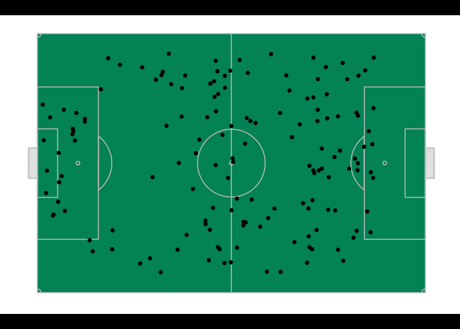

### fStripChart

    pStripChart = fStripChart (
       dtPlayerMetrics,
       vcColumnsToIndex = c('playerId','PlayerName','TeamName'),
       dtMetricCategorisation,
       iPlayerId = 2,
       cTitle = 'Sample'
    )
    #> Warning: `expand_scale()` is deprecated; use `expansion()` instead.

    print(pStripChart)

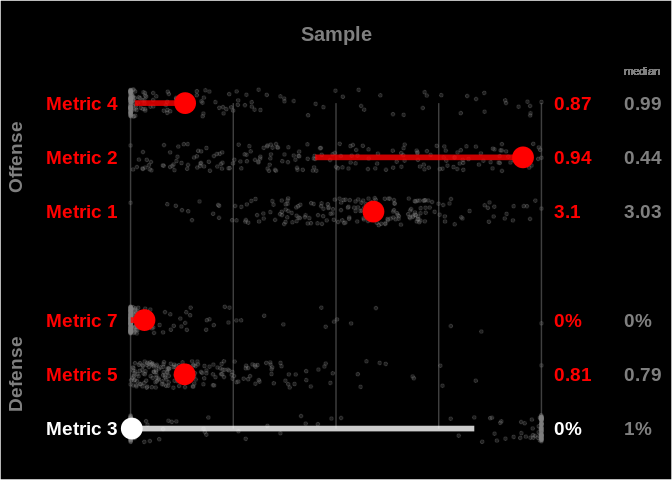

### fPercentileBarChart

    pPercentileBarChart = fPercentileBarChart(
       dtDataset = dtPlayerMetrics,
       vcColumnsToIndex = c('playerId','PlayerName','TeamName'),
       dtMetricCategorisation,
       iPlayerId = 2,
       cTitle = 'Sample'
    )
    print(pPercentileBarChart)

### fPercentileBarChart with AbsoluteIndicator

Percentiles can be a little misleading if the underlying numbers aren’t
uniformly distributed. You can add annotations for an indicator of the
absolute spread of the values and where this particular player’s values
fall within that spread.

    pPercentileBarChart = fPercentileBarChart(
       dtDataset = dtPlayerMetrics,
       vcColumnsToIndex = c('playerId','PlayerName','TeamName'),
       dtMetricCategorisation,
       iPlayerId = 2,
       cTitle = 'Sample',
       # vnQuantileMarkers = c(0.01, 0.25, 0.5, 0.75, 0.99),
       bAddAbsoluteIndicator = T
    )

    print(pPercentileBarChart)

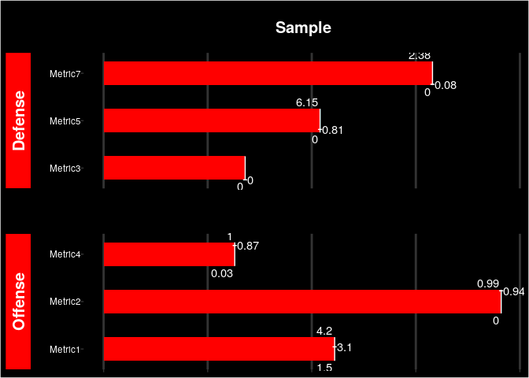

### fRadarPercentileChart

I disapprove of radar charts. It’s a bad visualisation, prone to
misinterpretation. They seem to be the accepted norm of comparing
players though which is why I had to sell out and have an implementation
of that in the package, but I’ve added a warning which states how you
should use fPercentileBarChart instead as that is a better structured
visualisation.

    pRadarPercentileChart = fRadarPercentileChart (
       dtPlayerMetrics = dtPlayerMetrics,
       vcColumnsToIndex = c('playerId','PlayerName','TeamName'),
       dtMetricCategorisation = dtMetricCategorisation,
       iPlayerId = 2,
       cTitle = 'Sample'
    )
    #> Warning in fRadarPercentileChart(dtPlayerMetrics = dtPlayerMetrics,
    #> vcColumnsToIndex = c("playerId", : Radar charts are bad. Use fPercentileBarChart
    #> instead.
    #> Warning: `expand_scale()` is deprecated; use `expansion()` instead.

    #> Warning: `expand_scale()` is deprecated; use `expansion()` instead.
    print(pRadarPercentileChart)

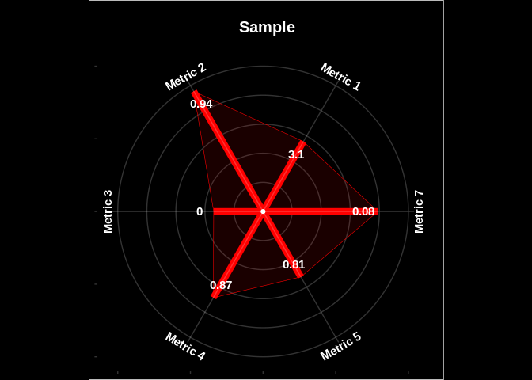

### fPlotSonar

    pPlotSonar = fPlotSonar(
       dtPassesToPlot = dtPasses,
       iBlocksInFirstRing = 4,
       iNbrRings = 8,
       nZoomFactor = NULL,
       nXLimit = 120,
       nYLimit = 80,
       bAddPitchBackground = F,
       cTitle = NULL
    )
    print(pPlotSonar)

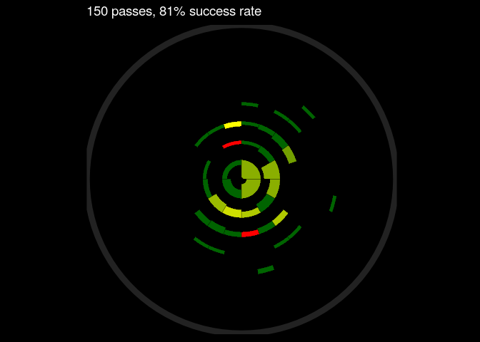

    # Sonar broken up by pitch area
    dtPassesByPitchArea = dtPasses[,
       list(
          playerId,
          passLength,
          passAngle,
          x,
          y,
          Success,
          xBucket = (
             ifelse(
                x %/% 20 == 120 %/% 20,
                ( x %/% 20 ) - 1,
                x %/% 20
             ) * 20
          ) + 10,
          yBucket = (
             ifelse(
                y %/% 20 == 80 %/% 20,
                ( y %/% 20 ) - 1,
                y %/% 20
             ) * 20
          ) + 10
       )
    ]

    pPlotSonarVariation1 = fPlotSonar(
       dtPassesToPlot = dtPassesByPitchArea,
       iBlocksInFirstRing = 4,
       iNbrRings = 8,
       nZoomFactor = NULL,
       nXLimit = 120,
       nYLimit = 80,
       bAddPitchBackground = T,
       cTitle = 'Sample by Area of Pitch'
    )
    print(pPlotSonarVariation1)

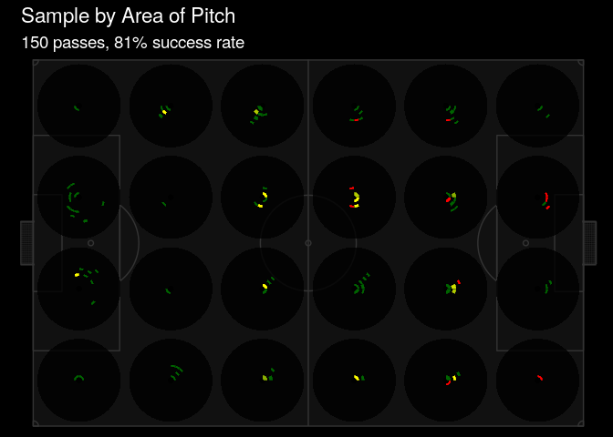

    # Sonar broken up player, placed at their median passing location
    dtPassesByPlayer = merge(
       dtPasses,
       merge(
          dtPasses[,
             list(
                xBucket = median(x),
                yBucket = median(y)
             ),
             list(
                playerId
             )
          ],
          dtPlayerLabels[,
             list(
                playerId,
                bucketLabel = playerName
             )
          ],
          c(
             'playerId'
          )
       ),
       c(
          'playerId'
       )
    )

    pPlotSonarVariation2 = fPlotSonar (
       dtPassesToPlot = dtPassesByPlayer,
       iBlocksInFirstRing = 4,
       iNbrRings = 8,
       nYLimit = 80,
       nXLimit = 120,
       bAddPitchBackground = T,
       cTitle = 'Sample By Median Position On Pitch'
    )
    print(pPlotSonarVariation2)

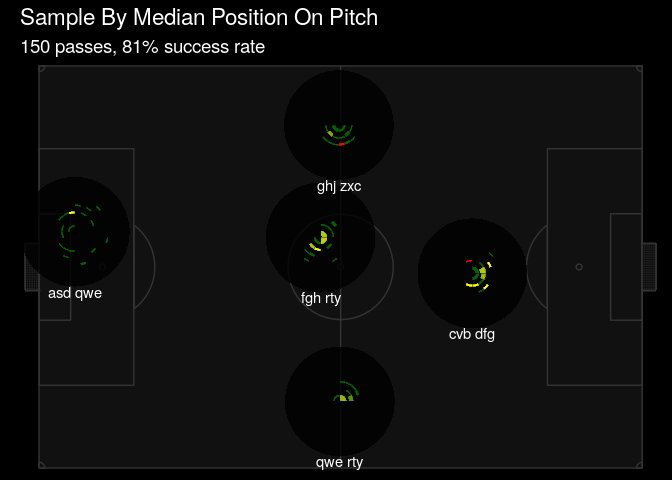

    # Sonar broken up player, placed at the location dictated by their role
    # in the formations

    dtPassesByPlayerFormation = merge(
       dtPasses,
       merge(
          dtFormation[,
             list(
                xBucket = x,
                yBucket = y,
                playerId
             )
          ],
          dtPlayerLabels[,
             list(
                playerId,
                bucketLabel = playerName
             )
          ],
          c(
             'playerId'
          )
       ),
       'playerId'
    )
    pPlotSonarVariation3 = fPlotSonar(
       dtPassesToPlot = dtPassesByPlayerFormation,
       iBlocksInFirstRing = 4,
       iNbrRings = 8,
       nXLimit = 120,
       nYLimit = 80,
       bAddPitchBackground = T,
       cTitle = 'Sample By Formation'
    )
    print(pPlotSonarVariation3)

### fPassNetworkChart

    pPassNetworkChart = fPassNetworkChart(
       dtPasses,
       dtPlayerLabels
    )
    print(pPassNetworkChart)

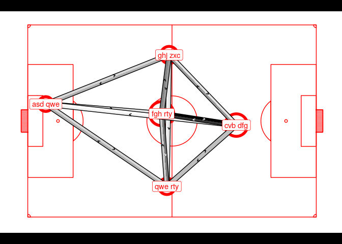

### fXgBuildUpComparison

    pXgBuildUpComparison = fXgBuildUpComparison(
       dtXg,
       dtTeamLabels
    )
    print(pXgBuildUpComparison)

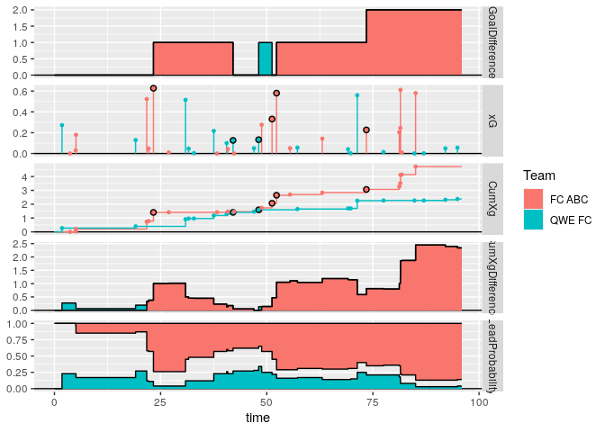

### fDrawVoronoi

WIP using the same data structure as
<a href="https://github.com/metrica-sports/sample-data" class="uri">https://github.com/metrica-sports/sample-data</a>

    pVoronoi = fDrawVoronoiFromTable(
       dtTrackingSlice[Frame == min(Frame)],
       nXLimit = 120,
       nYLimit = 80
    )

    print(pVoronoi)

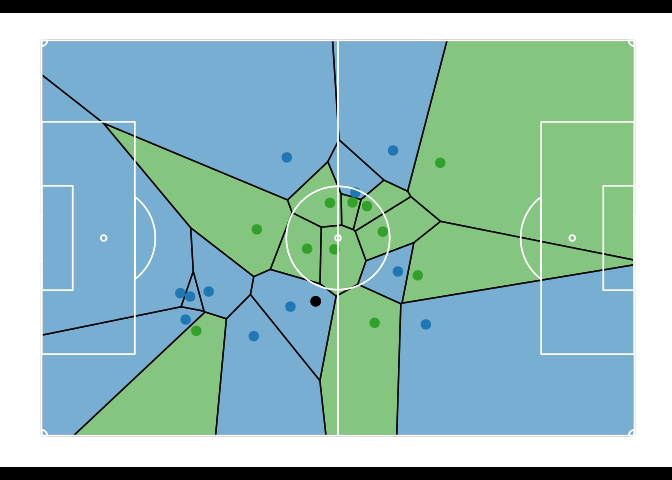

And if you have multiple frames -

    voronoiOutput = fDrawVoronoiFromTable(
       dtTrackingSlice,
       nXLimit = nXLimit,
       nYLimit = nYLimit,
       UseOneFrameEvery = 1,
       DelayBetweenFrames = 5
    )

    if ( !interactive() ) {

       qwe = suppressWarnings(
          file.remove('./README_files/figure-markdown_strict/Voronoi.gif')
       )
       rm(qwe)

       qwe = file.copy(
          voronoiOutput,
          './README_files/figure-markdown_strict/Voronoi.gif'
       )

       rm(qwe)

    }

 More experiments
with Voronoi here -
<a href="https://github.com/thecomeonman/MakingFriendsWithTrackingData" class="uri">https://github.com/thecomeonman/MakingFriendsWithTrackingData</a>

Logic and Algorithms
--------------------

### fEMDDetailed

A function to calculate earth mover’s distance. It offers more
flexibility and transparency than emdist:emd.

Any distance matrix can be used to calculated EMD, but emdist:emd
insists on getting the raw distributions with only up to four
dimensions. fEMDDetailed only requires a distance matrix between each
combination of observations in the two datasets, irrespective of the
nature of the data.

    # Two random datasets of three dimension
    a = data.table(matrix(runif(21), ncol = 3))
    b = data.table(matrix(runif(30), ncol = 3))

    # adding serial numbers to each observation
    a[, SNO := .I]
    b[, SNO := .I]

    # evaluating distance between all combinations of data in the two datasets
    a[, k := 'k']
    b[, k := 'k']
    dtDistances = merge(a,b,'k',allow.cartesian = T)
    dtDistances[,
       Distance := (
          (( V1.x - V1.y) ^ 2) +
          (( V2.x - V2.y) ^ 2) +
          (( V3.x - V3.y) ^ 2)
       ) ^ 0.5
    ]

    # getting EMD between this dataet
    lprec = fEMDDetailed(
       SNO1 = dtDistances[, SNO.x],
       SNO2 = dtDistances[, SNO.y],
       Distance = dtDistances[, Distance]
    )

    print(fGetEMDFromDetailedEMD(lprec))
    #> [1] 0.4536791

    # This value should be the same as that computed by emdist package's emd function.
    # EMD needs the weightage of each point, which is assigned as equal in our
    # function, so giving 1/N weightage to each data point
    # emdist::emd(
    #    as.matrix(
    #       a[, list(1/.N, V1,V2,V3)]
    #    ),
    #    as.matrix(
    #       b[, list(1/.N, V1,V2,V3)]
    #    )
    # ))

On the topic of transparency, one of the things I find very useful is
that you can now see how much distance is being contributed by each
observation.

    dtDistances[, EMDWeightage := get.variables(lprec)]
    ggplot(dtDistances) +
       geom_point(
          data = dtDistances,
          aes(
             x = factor(SNO.x),
             y = factor(SNO.y),
             size = Distance,
             color = EMDWeightage
          )
       ) +
       scale_colour_continuous(
          low = 'black',
          high = 'red'
       ) +
       coord_fixed() +
       xlab('SNO.x') +
       ylab('SNO.y')

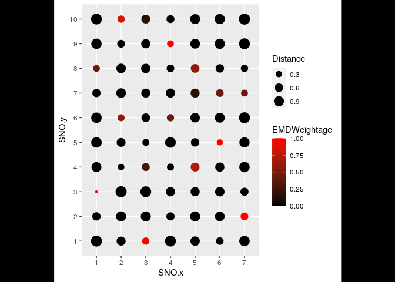

Data Parsing
------------

You will find `fJsonToListOfTables`, `fJsonToTabular`,
`fParseTrackingData` useful. They aren’t glamarous enough to be demoed
here but the documentation should help you use those functions.
